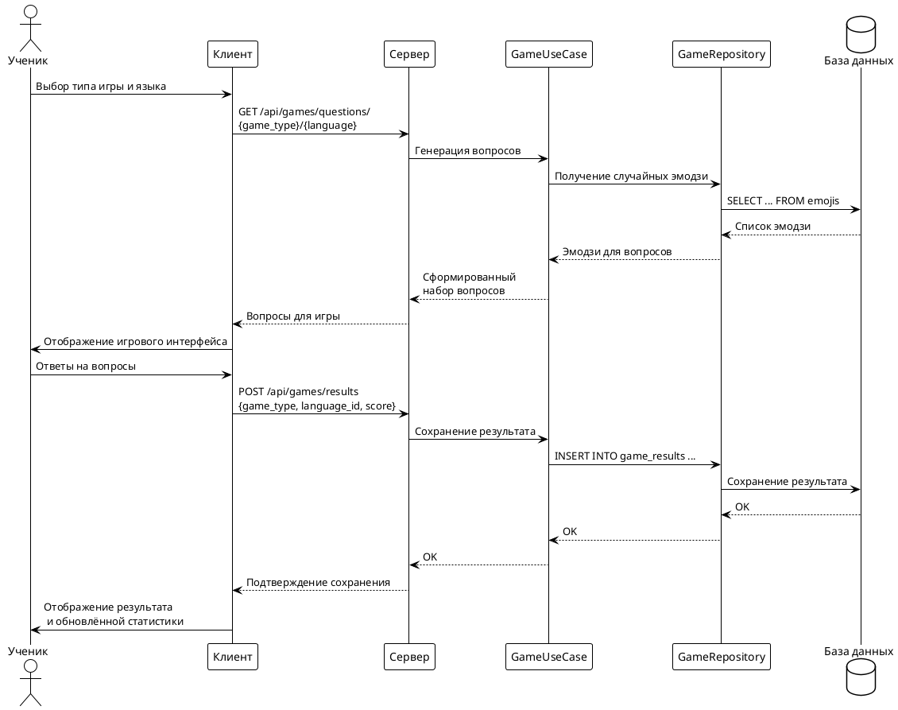

## 3.4 Геймификация

Геймификация на платформе реализована как отдельный модуль, направленный на повышение мотивации и вовлечённости пользователей в процесс изучения языков. Основная идея заключается во внедрении игровых механик — викторин и соревнований, которые позволяют ученикам практиковать языковые навыки в интерактивной форме и получать за это очки.

### Основные игровые механики

В платформе реализованы два типа языковых игр:

- **Викторина с эмодзи (Emoji Quiz)** — пользователю предлагается выбрать правильное название эмодзи из нескольких вариантов на выбранном языке. За каждый правильный ответ начисляются очки.
- **Набор эмодзи (Emoji Typing)** — игроку необходимо самостоятельно ввести правильное название эмодзи. Этот режим требует большего уровня владения языком и поощряет внимательность.

Каждая игра поддерживает выбор языка (английский, испанский, русский), что позволяет адаптировать задания под индивидуальные цели пользователя.

### Интеграция с backend и frontend

Игровой модуль интегрирован с обеими частями платформы:
- **Frontend** реализует отдельный раздел с языковыми играми, где пользователь может выбрать тип игры и язык, а также просмотреть свою статистику и таблицу лидеров. Вся логика взаимодействия с сервером вынесена в отдельные сервисы, что обеспечивает модульность и простоту расширения.
- **Backend** отвечает за генерацию игровых вопросов, обработку результатов и ведение таблицы лидеров. Для этого реализованы отдельные usecase и репозитории, которые инкапсулируют бизнес-логику и взаимодействие с базой данных. Вся информация о результатах игр, набранных очках и сериях активности сохраняется в соответствующих таблицах.

### Хранение и обработка результатов

Результаты игр фиксируются на сервере: для каждого пользователя сохраняется количество набранных очков, выбранный язык, тип игры, а также временные метки прохождения. Это позволяет формировать индивидуальную статистику, отслеживать прогресс и поддерживать таблицу лидеров. Для повышения мотивации реализован механизм серий (streaks) — система отслеживает, сколько дней подряд пользователь проявлял активность в играх.

### Таблица лидеров и мотивация

В платформе реализована публичная таблица лидеров, где отображаются лучшие игроки по сумме набранных очков и длине серии. Пользователь может видеть своё место в рейтинге, сравнивать результаты с другими участниками и стремиться к новым достижениям. Такой подход способствует формированию здоровой конкуренции и поддерживает интерес к регулярным занятиям.

### Архитектурные особенности

- **Масштабируемость**: Игровой модуль спроектирован так, чтобы легко добавлять новые типы игр и расширять функционал без изменения существующей архитектуры.
- **Безопасность**: Все игровые действия защищены авторизацией, результаты сохраняются только для аутентифицированных пользователей.
- **Гибкость**: Вся бизнес-логика геймификации инкапсулирована в отдельных слоях backend, а frontend реализует современный и дружелюбный интерфейс для взаимодействия с играми.

#### Пример взаимодействия компонентов при прохождении игры

Взаимодействие между компонентами платформы при прохождении языковой игры включает несколько последовательных этапов. Сначала пользователь на клиенте выбирает тип игры (викторина или набор) и язык, на котором хочет практиковаться. После этого клиентское приложение отправляет запрос на сервер для получения набора игровых вопросов. На стороне сервера usecase формирует вопросы, обращаясь к репозиторию для получения случайных эмодзи из базы данных. Сформированный набор вопросов возвращается на клиент, где отображается пользователю в игровом интерфейсе. Пользователь отвечает на вопросы, взаимодействуя с интерфейсом, а по завершении игры клиент отправляет результаты (тип игры, язык, набранные очки) на сервер. Сервер сохраняет результат в базе данных через usecase и репозиторий. После успешного сохранения результата клиент отображает пользователю обновлённую статистику и подтверждение.

---

Таким образом, геймификация органично интегрирована в архитектуру платформы и способствует формированию устойчивой учебной мотивации, поддерживая интерес пользователей к регулярной языковой практике. 