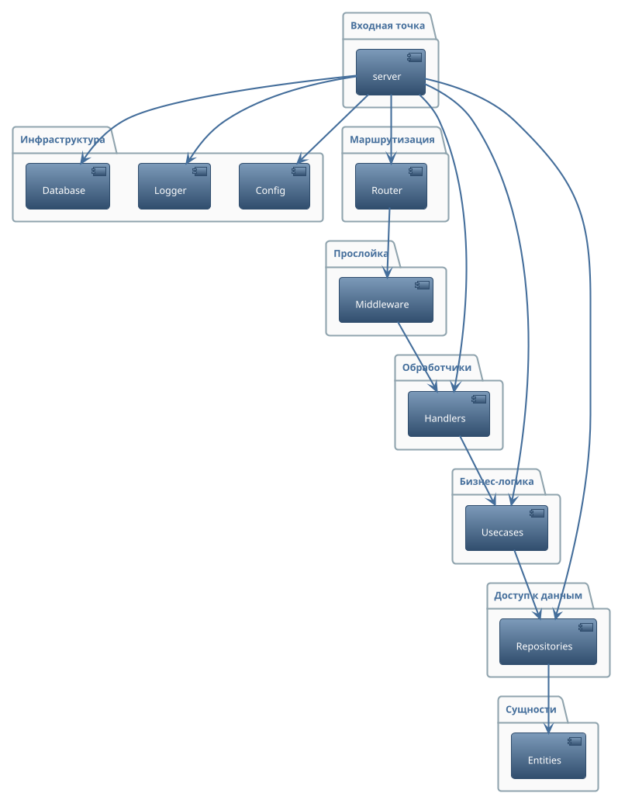

# Архитектура backend

Архитектура backend-приложения построена на принципах чистой архитектуры (Clean Architecture), что обеспечивает модульность, масштабируемость и простоту поддержки кода. В основе лежит разделение на несколько ключевых слоёв, каждый из которых отвечает за свою область ответственности и минимально зависит от других.

В центре архитектуры находятся сущности (Entities), которые представляют основные бизнес-объекты системы и инкапсулируют бизнес-логику, не зависящую от инфраструктуры. Следующий слой — репозитории (Repositories), реализующие доступ к данным и взаимодействие с базой данных. Они предоставляют абстракцию для хранения и извлечения сущностей, что позволяет легко менять способ хранения данных без влияния на бизнес-логику.

Бизнес-правила и сценарии использования инкапсулируются в слое usecase (Usecases). Этот слой реализует основную логику приложения, используя репозитории для доступа к данным. Такой подход позволяет изолировать бизнес-логику от деталей реализации хранения и взаимодействия с внешними системами.

Внешний слой архитектуры — обработчики (Handlers), которые реализуют HTTP-интерфейс приложения с помощью фреймворка Gin. Они принимают и валидируют входящие запросы, вызывают соответствующие usecase и формируют ответы. Маршрутизация запросов осуществляется через отдельный слой router, который также подключает middleware для логирования, CORS и аутентификации.

Вспомогательные слои включают конфигурацию (Config), логирование (Logger) и работу с базой данных (Database), которые вынесены в отдельные модули для переиспользования и удобства настройки. Middleware реализуют кросс-срезные задачи, такие как логирование, аутентификация через JWT и проверка ролей пользователей.

Точка входа в приложение находится в модуле cmd/server, где происходит инициализация всех компонентов и запуск HTTP-сервера.

Выбор такой архитектуры обусловлен необходимостью обеспечить независимость бизнес-логики от инфраструктурных деталей, что позволяет легко тестировать, масштабировать и развивать приложение. Благодаря строгому разделению ответственности каждый слой можно изменять и расширять независимо от других, что особенно важно для долгосрочной поддержки и развития проекта. Такой подход также облегчает внедрение новых технологий или смену используемых библиотек без необходимости переписывать всю систему.

---

## PlantUML-диаграмма архитектуры

