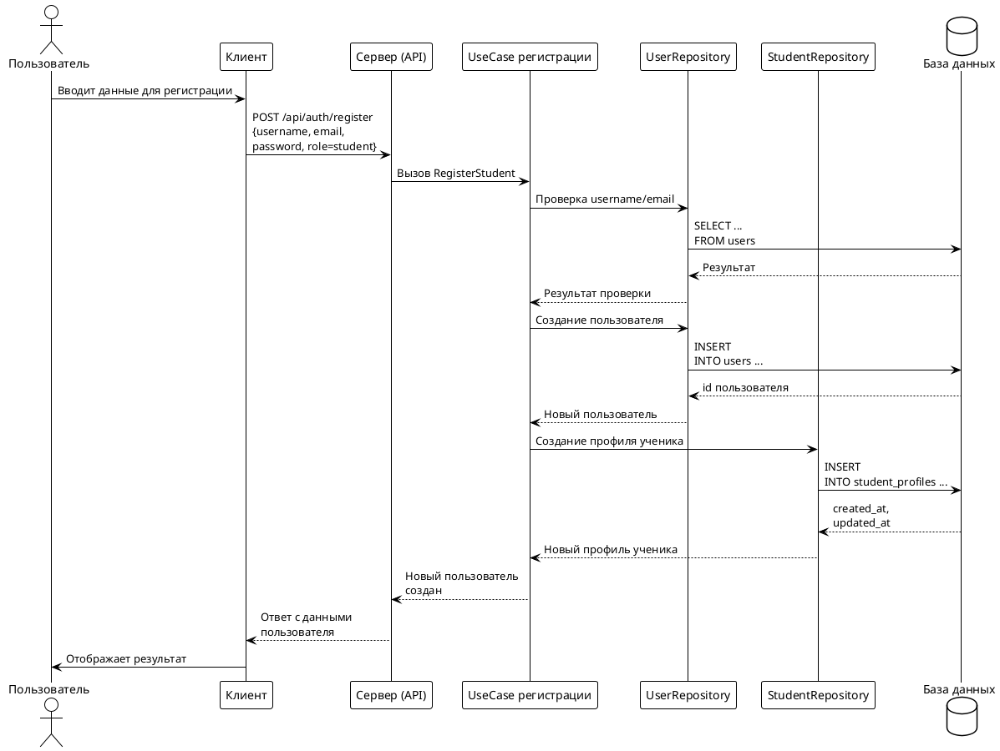

# 3.1 Работа с БД

В рамках реализации платформы была спроектирована и создана реляционная база данных, обеспечивающая хранение и обработку информации о пользователях, их интересах, целях, языках, а также о проведении уроков, результатах геймификации и других сущностях, необходимых для функционирования системы.

Создание базы данных осуществлялось с помощью миграций, в которых определены все необходимые таблицы, их связи и ограничения целостности. В частности, были созданы таблицы для хранения пользователей (`users`), языков (`languages`), уровней владения языком (`language_proficiency`), интересов (`interests`), целей обучения (`goals`), а также таблицы для профилей студентов и преподавателей, расписания, уроков, отзывов, результатов игр и эмодзи. Для обеспечения целостности данных использовались внешние ключи с различными стратегиями удаления и обновления связанных записей.

Особое внимание было уделено автоматизации обновления временных меток изменений записей. Для этого реализована функция `update_updated_at_column`, которая срабатывает при каждом обновлении строки в ряде ключевых таблиц (например, `users`, `student_profiles`, `tutor_profiles`, `tutor_availability`, `lessons`). Эта функция применяется с помощью триггеров, что позволяет автоматически обновлять поле `updated_at` без необходимости явно указывать это в каждом SQL-запросе. Такой подход обеспечивает корректное отслеживание изменений и упрощает сопровождение кода.

Для повышения производительности и ускорения выполнения запросов, связанных с выборкой по часто используемым полям, были созданы индексы. Индексация реализована для таких полей, как роль пользователя, идентификаторы пользователей в связующих таблицах, идентификаторы уроков, языков, а также временные метки. Это позволяет эффективно обрабатывать запросы к большим объемам данных и поддерживать высокую отзывчивость системы.

---

## Интеграция backend с базой данных и пример регистрации ученика

Интеграция серверного приложения с базой данных PostgreSQL реализована с использованием пакета `sqlx`, который расширяет стандартный `database/sql` возможностями сканирования результатов запросов непосредственно в структуры и поддержкой именованных параметров. Для структурирования кода взаимодействия с базой данных применяется паттерн Repository, инкапсулирующий логику работы с хранилищем данных для каждой бизнес-сущности (например, UserRepository, StudentRepository).

Процесс регистрации нового ученика включает несколько этапов: создание пользователя, создание профиля ученика, а также добавление языков, интересов и целей. Вся бизнес-логика регистрации инкапсулирована в соответствующем usecase, который координирует работу репозиториев. Ниже приведена диаграмма последовательности (dataflow) для процесса регистрации ученика:

Диаграмма выше иллюстрирует последовательность взаимодействия компонентов системы при регистрации нового ученика на платформе. Процесс начинается с того, что пользователь вводит необходимые данные на клиенте, после чего эти данные отправляются на сервер через HTTP-запрос. Серверный API передаёт управление в usecase регистрации, который инкапсулирует бизнес-логику процесса.

В первую очередь usecase обращается к репозиторию пользователей для проверки уникальности имени пользователя и электронной почты. Репозиторий выполняет соответствующий запрос к базе данных и возвращает результат проверки. Если данные уникальны, usecase инициирует создание новой записи пользователя, и репозиторий вновь взаимодействует с базой данных, возвращая идентификатор созданного пользователя.

Далее usecase передаёт управление репозиторию профилей учеников для создания связанного профиля, который также сохраняется в базе данных. После успешного создания профиля репозиторий возвращает подтверждение usecase. На заключительном этапе usecase сообщает серверу об успешном завершении регистрации, и сервер отправляет клиенту ответ с данными нового пользователя. Клиент отображает результат пользователю.

Такой подход обеспечивает прозрачность и последовательность всех этапов регистрации, а также чёткое разделение ответственности между слоями приложения, что облегчает сопровождение и масштабирование системы.