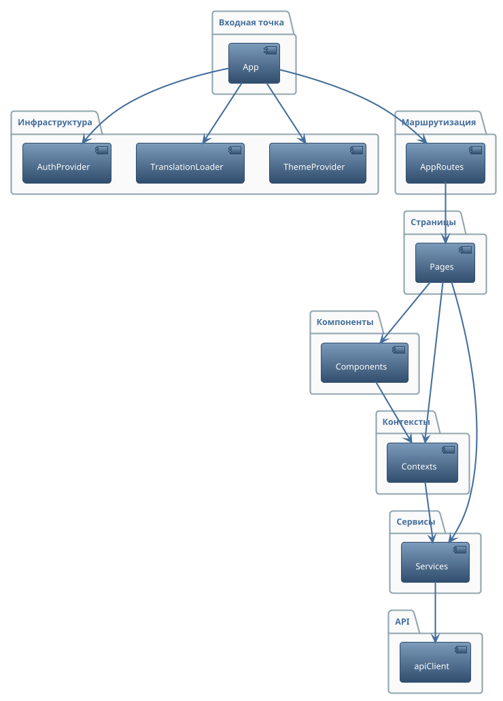

## 2.4 Архитектура клиентской части (фронтенда)

Архитектура клиентской части платформы построена на принципах модульности и разделения ответственности (Рисунок 4). 
Входной точкой выступает компонент App, который инициализирует маршрутизацию (AppRoutes), управление темой (ThemeProvider), локализацией (TranslationLoader), аутентификацией (AuthProvider). 
Следующий слой — маршрутизация (AppRoutes), она отвечает за навигацию между страницами, разграничение доступа по ролям и связывание пользовательских действий с соответствующими страницами.
Страницы (Pages) представляют отдельные пользовательские сценарии: регистрацию, вход, поиск преподавателей, планирование уроков, управление расписанием, языковые игры и настройки профиля. Каждая страница использует компоненты (Components) интерфейса, сгруппированные по функциональным областям.
Бизнес-логика и работа с API серверной части вынесены в отдельные сервисы (Services), что позволяет изолировать взаимодействие с сервером и сторонними библиотеками от компонентов интерфейса. Такой подход облегчает повторное использование логики.
Для управления состоянием пользователя, темой и локализацией используются контексты (Contexts), что обеспечивает доступ к этим данным во всей клиентской части. Это позволяет легко масштабировать и изменять логику управления состоянием без влияния на остальные слои.
Выбор такой архитектуры обусловлен необходимостью обеспечить независимость пользовательского интерфейса, бизнес-логики и инфраструктурных деталей. Благодаря строгому разделению ответственности каждый слой можно изменять и расширять независимо от других, что особенно важно для долгосрочной поддержки и развития проекта. Такой подход также облегчает внедрение новых технологий или смену используемых библиотек без необходимости переписывать всю систему.

---

