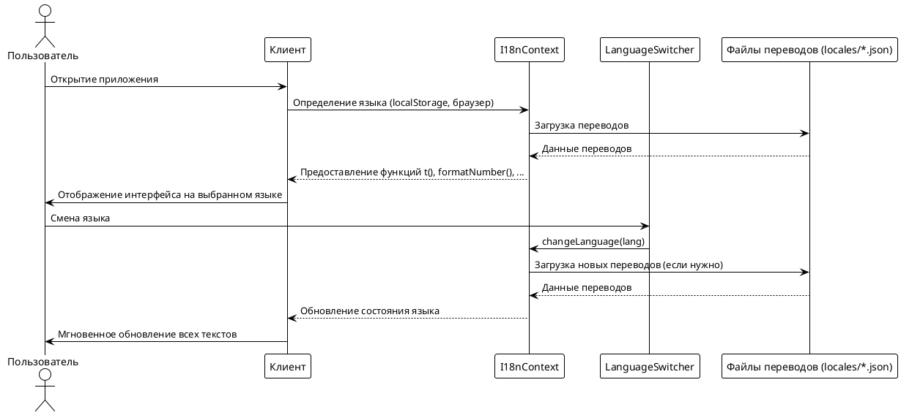

## Локализация интерфейса

Локализация интерфейса на платформе реализована как самостоятельный модуль, обеспечивающий поддержку нескольких языков и адаптацию пользовательского опыта для разных аудиторий. Основная цель — предоставить каждому пользователю возможность взаимодействовать с платформой на привычном ему языке, что повышает доступность и удобство использования.

### Основные принципы и поддерживаемые языки

Платформа поддерживает три языка интерфейса: русский, английский и испанский. Все текстовые элементы, сообщения, кнопки и уведомления вынесены в отдельные файлы переводов (`locales/en.json`, `locales/ru.json`, `locales/es.json`). Структура переводов организована по тематическим разделам (например, `common`, `auth`, `pages`, `components`), что облегчает масштабирование и сопровождение системы локализации.

### Архитектура и интеграция

Локализация реализована с помощью собственного контекста `I18nContext`, который инкапсулирует всю логику работы с переводами. Контекст предоставляет функции для получения перевода по ключу (`t`), а также для форматирования чисел, дат и валют в соответствии с выбранным языком. Все компоненты приложения используют этот контекст для отображения текстов, что обеспечивает централизованное управление языковыми ресурсами.

Для выбора языка реализован отдельный компонент `LanguageSwitcher`, доступный пользователю в интерфейсе. Переключение языка происходит мгновенно, без перезагрузки страницы: выбранный язык сохраняется в состоянии приложения и применяется ко всем компонентам. При первом посещении платформа автоматически определяет язык пользователя на основе настроек браузера или сохранённых предпочтений.

### Хранение и использование переводов

Все переводы хранятся в формате JSON и загружаются статически при инициализации приложения. Для каждого языка поддерживается полный набор ключей, что позволяет избежать пропусков и несоответствий. При отсутствии перевода по ключу система возвращает сам ключ, что облегчает отладку и добавление новых языков.

**Пример структуры файла перевода (ru.json):**

```json
{
  "common": {
    "save": "Сохранить",
    "cancel": "Отмена",
    "delete": "Удалить"
  },
  "auth": {
    "login": "Вход",
    "register": "Регистрация",
    "logout": "Выход"
  }
}
```

В компонентах и страницах используется функция `t('ключ')` для получения перевода. Также поддерживается подстановка переменных и обработка множественного числа (pluralization), что особенно важно для корректного отображения динамических сообщений.

### Пример использования локализации в компоненте

```jsx
import { useTranslation } from '../contexts/I18nContext';

const { t } = useTranslation();

return <button>{t('auth.login')}</button>;
```

### Особенности реализации

- **Масштабируемость**: Архитектура локализации позволяет легко добавлять новые языки и расширять словарь переводов без изменений в бизнес-логике приложения.
- **Гибкость**: Все текстовые ресурсы централизованы, что упрощает процесс перевода и ревью.
- **Доступность**: Пользователь может в любой момент сменить язык интерфейса через удобный переключатель.
- **Интеграция с форматированием**: Помимо переводов, система поддерживает локализованное форматирование дат, чисел и валют.

### Взаимодействие компонентов при локализации интерфейса

Взаимодействие между компонентами платформы при локализации интерфейса включает несколько последовательных этапов. При запуске приложения определяется язык пользователя — сначала проверяются сохранённые предпочтения, затем настройки браузера, и только после этого выбирается язык по умолчанию. После этого загружаются соответствующие файлы переводов, и все компоненты получают доступ к функциям перевода через контекст `I18nContext`. При изменении языка через компонент `LanguageSwitcher` состояние приложения обновляется, и все тексты на странице мгновенно отображаются на выбранном языке. Такой подход обеспечивает целостность пользовательского опыта и позволяет гибко масштабировать систему локализации.



---

Таким образом, система локализации органично интегрирована в архитектуру frontend-платформы и обеспечивает комфортную работу пользователей с разным языковым бэкграундом. 