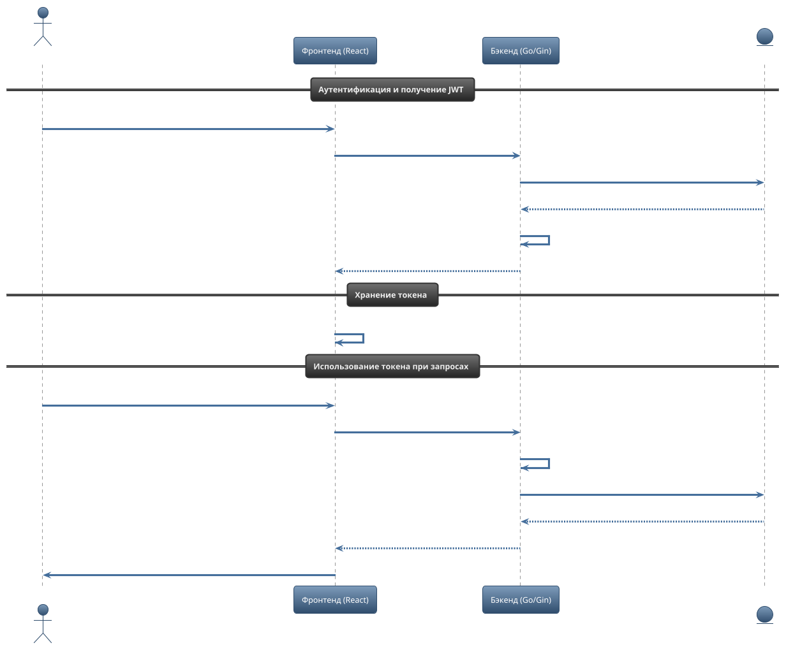

## 2.5 Взаимодействие клиентской и серверной частей. API платформы

Взаимодействие между клиентской и серверной частями платформы реализовано через RESTful API, обеспечивающее обмен данными в формате JSON. Клиентская часть (фронтенд) написана на TypeScript/React и обращается к серверу (бэкенду на Go) по защищённым HTTP(S)-эндпоинтам. Аутентификация пользователей осуществляется с помощью JWT-токенов, которые передаются в заголовках запросов.

JWT (JSON Web Token) служит компактным и безопасным способом передачи информации о пользователе между клиентом и сервером. В платформе этот механизм реализован следующим образом. Когда пользователь проходит аутентификацию, например, через эндпоинт `/api/auth/login`, сервер формирует JWT, в который включаются идентификатор пользователя, его роль и срок действия токена. Этот токен подписывается секретным ключом сервера, что исключает возможность его подделки. После успешного входа токен возвращается клиенту в теле ответа, обычно в формате JSON. На фронтенде токен сохраняется в хранилище браузера (`localStorage` или `sessionStorage`), что позволяет автоматически подставлять его в заголовок Authorization при каждом последующем запросе к защищённым эндпоинтам. Таким образом, при каждом обращении к API клиент добавляет заголовок `Authorization: Bearer <jwt>`, а сервер с помощью middleware извлекает токен, проверяет его подлинность и срок действия, а также определяет пользователя и его роль. Если токен невалиден или истёк, сервер возвращает ошибку авторизации, и клиент перенаправляет пользователя на страницу входа. Важно отметить, что токен не содержит пароля или другой чувствительной информации, а только идентификатор пользователя, роль и срок действия. Для повышения безопасности рекомендуется использовать HTTPS, чтобы исключить возможность перехвата токена злоумышленниками.

После входа в систему пользователь получает доступ к функционалу согласно своей роли — ученика или преподавателя. Для работы с уроками предусмотрен отдельный набор эндпоинтов, позволяющий планировать, просматривать, отменять занятия, а также оставлять отзывы по завершённым урокам. Все запросы к этим эндпоинтам защищены middleware, который проверяет подлинность и права пользователя.

### Принципы взаимодействия: пошаговый разбор

Взаимодействие между клиентом и сервером строится по следующей схеме:

1. **Пользователь инициирует действие**
   - Например, ученик выбирает преподавателя и нажимает кнопку «Запланировать урок» на клиентском интерфейсе.

2. **Фронтенд формирует и отправляет запрос**
   - В React-компоненте вызывается соответствующий сервис (например, `lesson.service.ts`), который формирует POST-запрос на эндпоинт `/api/lessons` с данными о преподавателе, языке, времени и заметкой.
   - JWT-токен пользователя автоматически добавляется в заголовок Authorization.

3. **Бэкенд принимает и обрабатывает запрос**
   - Сервер (Go, Gin) через middleware проверяет подлинность токена и определяет роль пользователя.
   - Контроллер (handler) валидирует входные данные, проверяет доступность времени у преподавателя, бизнес-правила (например, нельзя забронировать урок в прошлом).
   - Если всё корректно, создаётся запись в базе данных, и сервер возвращает клиенту данные созданного урока.

4. **Фронтенд обновляет интерфейс**
   - После успешного ответа серверa React-компонент обновляет состояние, отображая новый урок в списке предстоящих занятий.
   - В случае ошибки (например, время занято или не хватает прав) пользователю показывается уведомление с причиной.

5. **Просмотр, отмена и отзыв**
   - Для просмотра истории занятий, отмены или оставления отзыва фронтенд отправляет GET или POST-запросы на соответствующие эндпоинты.
   - Сервер возвращает актуальные данные, которые отображаются в интерфейсе пользователя.

#### Пример сценария: бронирование и отмена урока

- **Шаг 1:** Ученик выбирает преподавателя и время, нажимает «Запланировать урок».
- **Шаг 2:** Фронтенд отправляет POST `/api/lessons` с деталями урока.
- **Шаг 3:** Сервер проверяет данные, создаёт урок, возвращает его параметры.
- **Шаг 4:** Урок появляется в разделе «Мои уроки» у ученика и преподавателя.
- **Шаг 5:** Если ученик решает отменить урок, он нажимает «Отменить» — фронтенд отправляет POST `/api/lessons/{lessonId}/cancel` с причиной отмены.
- **Шаг 6:** Сервер проверяет, можно ли отменить урок (например, не менее чем за 24 часа до начала), и если всё корректно, помечает урок как отменённый.
- **Шаг 7:** Обновлённый статус урока отображается в интерфейсе обоих участников.

### Таблица эндпоинтов для работы с уроками

| Метод | URL                                | Описание                                      | Тело запроса / параметры         | Ответ                        |
|-------|------------------------------------|-----------------------------------------------|----------------------------------|------------------------------|
| POST  | `/api/lessons`                     | Забронировать (создать) новый урок            | `{ tutor_id, language_id, start_time, end_time, notes? }` | Данные созданного урока       |
| GET   | `/api/lessons/user`                | Получить все уроки пользователя (ученик/преподаватель) | —                                | Список уроков                |
| GET   | `/api/lessons/user/scheduled`      | Получить предстоящие уроки                    | —                                | Список предстоящих уроков     |
| GET   | `/api/lessons/user/past`           | Получить завершённые уроки                    | —                                | Список завершённых уроков     |
| GET   | `/api/lessons/user/cancelled`      | Получить отменённые уроки                     | —                                | Список отменённых уроков      |
| GET   | `/api/lessons/{lessonId}`          | Получить детали конкретного урока             | —                                | Данные урока                 |
| POST  | `/api/lessons/{lessonId}/cancel`   | Отменить урок                                 | `{ reason }`                     | Сообщение об успешной отмене  |
| POST  | `/api/lessons/{lessonId}/reviews`  | Оставить отзыв о завершённом уроке            | `{ rating }`                     | Данные созданного отзыва      |

**Примечания:**
- Все эндпоинты требуют авторизации (JWT).
- Для отмены урока действует ограничение: отменить можно только будущий урок, если до его начала осталось более 24 часов.
- Оставить отзыв можно только по завершённому уроку и только один раз.

### Архитектурные особенности

- Вся бизнес-логика по работе с уроками инкапсулирована на сервере, что обеспечивает целостность данных и соблюдение бизнес-правил.
- Клиентская часть реализует удобный пользовательский интерфейс для работы с расписанием, историей занятий и отзывами, используя данные, полученные через API.
- Такой подход позволяет легко масштабировать платформу, добавлять новые роли и сценарии без необходимости менять существующие контракты API. 