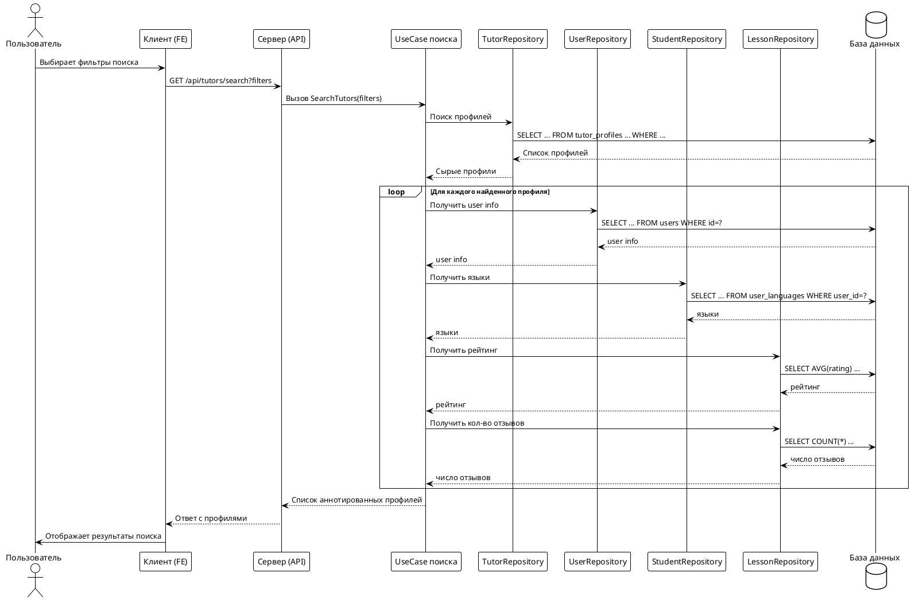

## Процесс поиска репетиторов с фильтрами

Поиск репетиторов осуществляется через клиентский интерфейс, где пользователь (студент) выбирает необходимые фильтры (языки, уровень владения, интересы, цели, опыт, возраст, пол и др.). После выбора фильтров формируется HTTP-запрос к серверу, который обрабатывает параметры, выполняет бизнес-логику поиска и возвращает список подходящих профилей.

### Пояснение к процессу

Процесс поиска репетиторов начинается с того, что пользователь на клиенте выбирает необходимые параметры поиска, такие как языки, интересы, опыт, возраст, пол и другие фильтры. После этого клиентская часть формирует GET-запрос на эндпоинт `/api/tutors/search`, передавая выбранные параметры в виде query-параметров. Серверная часть принимает этот запрос и передаёт управление в usecase поиска репетиторов, который инкапсулирует бизнес-логику. Usecase вызывает метод репозитория, отвечающего за поиск профилей по заданным фильтрам. Репозиторий формирует SQL-запрос, учитывая все переданные параметры: языки, уровень владения, интересы, цели, опыт, возраст и пол. После выполнения запроса к базе данных возвращается список подходящих профилей. Для каждого найденного профиля usecase дополнительно запрашивает информацию о пользователе, список языков, средний рейтинг и количество отзывов, чтобы обогатить профиль всей необходимой информацией. После этого итоговый список аннотированных профилей возвращается серверу, который отправляет клиенту JSON-ответ. Клиент отображает результаты поиска пользователю.

#### Формирование SQL-запроса для фильтрации

На этапе поиска репозиторий динамически формирует SQL-запрос, добавляя условия в зависимости от выбранных фильтров. Например, если пользователь указал языки, в запрос добавляется подзапрос с фильтрацией по языкам через таблицу `user_languages` и соответствующие идентификаторы языков. Аналогично, если задан минимальный опыт, добавляется условие по полю `years_experience`. Для фильтрации по уровню владения языком используется подзапрос с проверкой минимального значения `proficiency_id`. Интересы, цели, возраст и пол также добавляются в SQL-запрос как отдельные условия с помощью конструкции `AND`. Все условия объединяются в единую WHERE-часть, что позволяет гибко фильтровать репетиторов по любым комбинациям параметров. Такой подход обеспечивает высокую точность и производительность поиска, а также масштабируемость при добавлении новых фильтров.

**Примечания:**
- Все фильтры (языки, уровень, интересы, цели, опыт, возраст, пол) обрабатываются на уровне SQL-запроса.
- Для каждого профиля дополнительно подтягиваются связанные сущности (user, языки, рейтинг, отзывы).