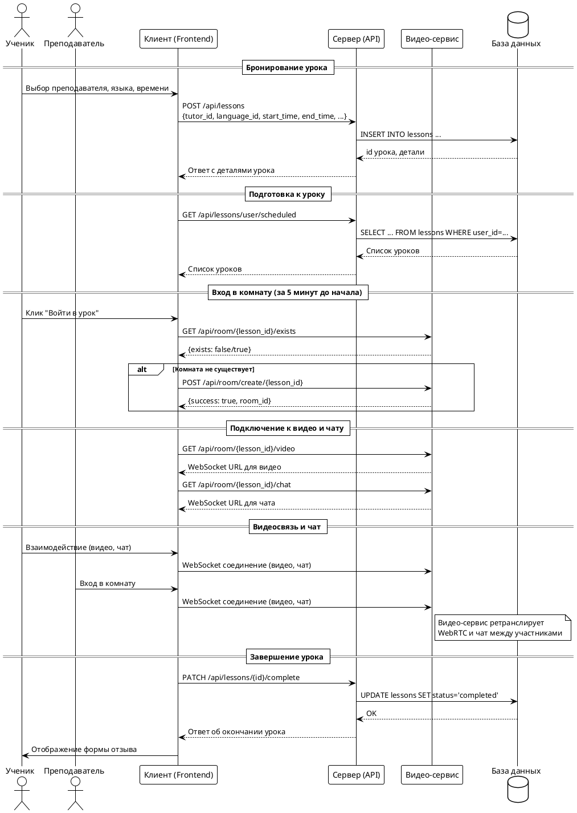
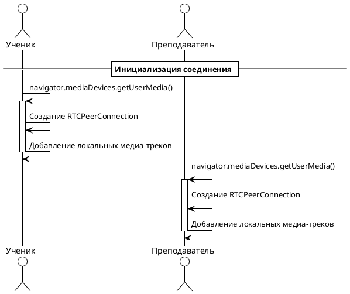
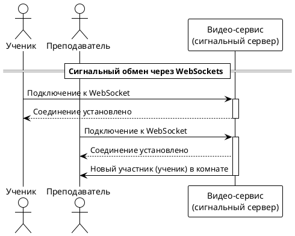
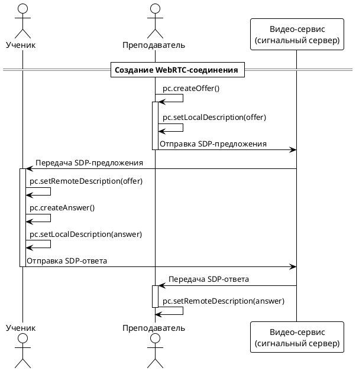
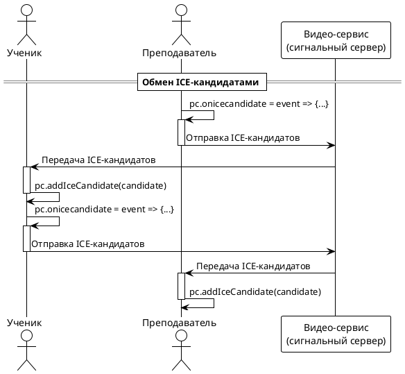
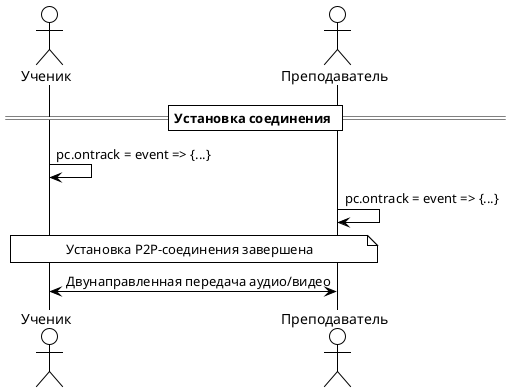
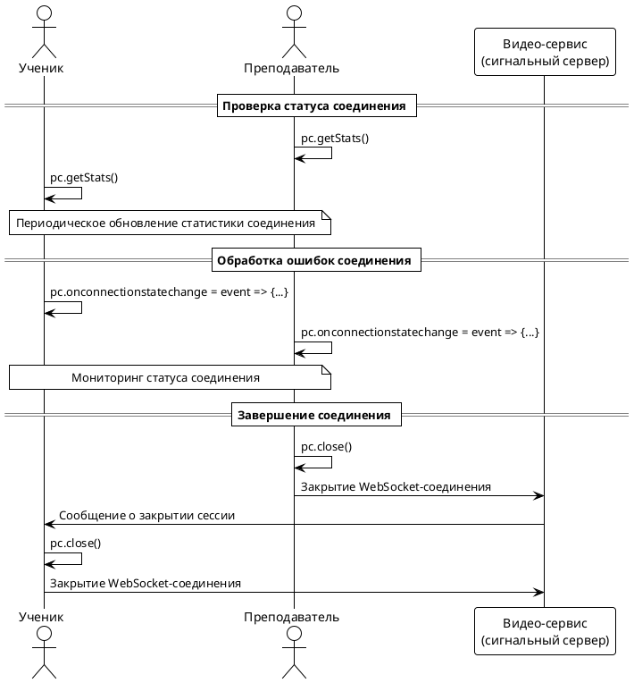

## 3.2 Проведение урока

Проведение онлайн-урока на платформе реализовано как интеграция клиентской части (frontend) и видео-сервиса (video-service), обеспечивающей бронирование, запуск и проведение видеосессии между учеником и преподавателем. Процесс включает несколько этапов: бронирование урока, подготовка комнаты, подключение участников и завершение урока.

### Этапы проведения урока

1. **Бронирование урока**  
   Ученик выбирает преподавателя, язык, дату и время, после чего отправляет запрос на бронирование. Сервер сохраняет урок в базе данных.

2. **Подготовка к уроку**  
   Перед началом урока оба участника видят список своих уроков. За 5 минут до старта появляется возможность войти в виртуальную комнату.

3. **Создание и подключение к видео-комнате**  
   При входе в комнату frontend проверяет существование комнаты в видео-сервисе (по ID урока). Если комнаты нет — она создаётся. Далее оба участника подключаются к WebRTC-видеосвязи и чату.

4. **Проведение урока**  
   Видеосвязь и чат осуществляются через WebRTC и WebSocket-соединения с видео-сервисом. Весь трафик идёт напрямую между браузерами, сервер выступает как сигналинг и ретранслятор.

5. **Завершение урока**  
   По окончании времени урока или по инициативе участников комната закрывается, статус урока обновляется, появляется возможность оставить отзыв.

---

### Dataflow-диаграмма процесса создания и проведения урока

---

### Описание диаграммы

- **Ученик** инициирует бронирование через клиентское приложение, данные отправляются на сервер, где создаётся запись урока.
- **Клиент** периодически запрашивает список уроков для отображения расписания.
- За 5 минут до начала урока появляется кнопка "Войти". При нажатии клиент проверяет наличие комнаты в видео-сервисе, при необходимости создаёт её.
- Для подключения к видео и чату клиент получает WebSocket-адреса и устанавливает соединения.
- Видеосвязь и чат реализованы через WebRTC и WebSocket, сервер видео-сервиса управляет комнатами и ретрансляцией.
- После завершения урока статус обновляется, появляется возможность оставить отзыв.

---

### Ключевые особенности реализации

- **Масштабируемость**: Комнаты создаются динамически, идентификатором служит ID урока.
- **Безопасность**: Доступ к комнате возможен только для участников урока.
- **Гибкость**: Видеосервис и API разделены, что позволяет масштабировать их независимо.

---

### 3.2.1 Реализация WebRTC-соединения

WebRTC-соединение между учеником и преподавателем устанавливается через несколько последовательных этапов, обеспечивающих надежную P2P-связь с минимальной задержкой. Процесс полностью соответствует архитектуре проекта, где frontend отвечает за пользовательский интерфейс и медиа-потоки, а video-service выполняет роль сигнального сервера.

#### Основные технические термины

- **WebRTC (Web Real-Time Communication)** — технология, позволяющая браузерам обмениваться аудио, видео и данными напрямую, без необходимости в плагинах или дополнительном ПО.
- **SDP (Session Description Protocol)** — протокол описания сессии, содержащий информацию о медиа-потоках, кодеках, битрейте и других параметрах соединения.
- **ICE (Interactive Connectivity Establishment)** — протокол для обнаружения и установления сетевых путей между участниками, преодолевающий NAT и брандмауэры.
- **STUN (Session Traversal Utilities for NAT)** — протокол, позволяющий узнать внешний IP-адрес устройства за NAT.
- **TURN (Traversal Using Relays around NAT)** — протокол для ретрансляции трафика, когда прямое соединение невозможно.

#### Инициализация медиа и PeerConnection

На первом этапе каждый участник (ученик и преподаватель) запрашивает доступ к камере и микрофону через API `getUserMedia`. После получения медиа-потоков создаётся объект `RTCPeerConnection`, в который добавляются локальные аудио- и видеотреки. Это подготовительный этап для установления WebRTC-соединения.

#### Сигнальный обмен через WebSocket

Оба участника подключаются к сигнальному серверу (video-service) по WebSocket-протоколу, используя уникальный идентификатор комнаты (lesson_id). Сервер уведомляет участников о появлении друг друга, что инициирует дальнейший обмен SDP и ICE-кандидатами.

#### Обмен SDP (Session Description Protocol)

Преподаватель создаёт SDP-предложение (`offer`), устанавливает его как локальное описание и отправляет через сигнальный сервер ученику. Ученик принимает предложение, создаёт SDP-ответ (`answer`), устанавливает его как локальное описание и отправляет обратно. Это позволяет согласовать параметры медиа-соединения, включая кодеки, битрейт и другие характеристики.

#### Обмен ICE-кандидатами

После обмена SDP участники начинают обмениваться ICE-кандидатами — информацией о возможных сетевых путях для установления P2P-соединения. Кандидаты пересылаются через сигнальный сервер до тех пор, пока не будет найден оптимальный маршрут. Это позволяет преодолеть сетевые барьеры, такие как NAT и брандмауэры.

#### Установка и поддержка соединения

После успешного обмена SDP и ICE-кандидатами устанавливается P2P WebRTC-соединение. Участники получают медиа-треки друг друга через обработчик события `ontrack` и начинается двусторонняя передача аудио и видео. На этом этапе трафик идет напрямую между браузерами участников, минуя сервер, что обеспечивает минимальную задержку.

#### Мониторинг и завершение соединения

В процессе работы участники могут мониторить состояние соединения и получать статистику (битрейт, задержки и т.д.) через метод `getStats()`. При возникновении ошибок или по завершении урока соединение закрывается методом `close()`, WebSocket-сессии разрываются, участники уведомляются о завершении.

#### Особенности реализации WebRTC в проекте

- **Прямое P2P-соединение**: Аудио и видео передаются напрямую между браузерами участников, что обеспечивает минимальную задержку.
- **Резервный TURN-сервер**: При невозможности установить прямое соединение используется TURN-сервер для ретрансляции трафика.
- **Адаптивное качество**: WebRTC автоматически адаптирует качество видео и аудио под доступную пропускную способность сети.
- **Шифрование**: Весь медиа-трафик шифруется по протоколу DTLS, обеспечивая безопасность передачи данных.
- **Обработка сбоев**: Система мониторит состояние соединения и автоматически пытается восстановить его при разрывах. 