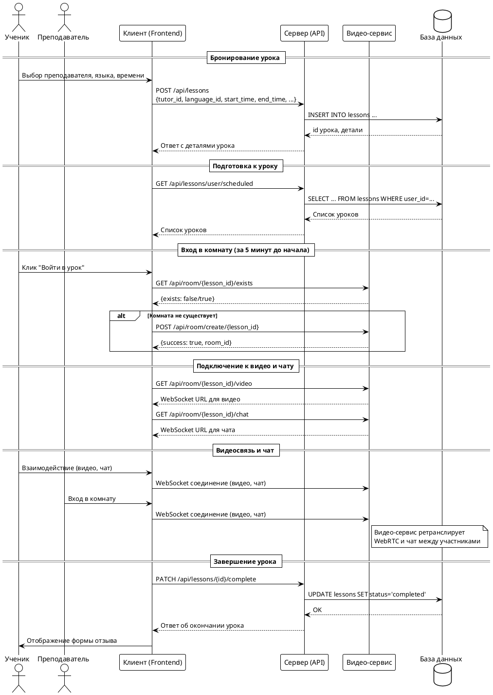

## 3.2 Проведение урока

Проведение онлайн-урока на платформе реализовано как интеграция клиентской части (frontend) и видео-сервиса (video-service), обеспечивающей бронирование, запуск и проведение видеосессии между учеником и преподавателем. Процесс включает несколько этапов: бронирование урока, подготовка комнаты, подключение участников и завершение урока.

### Этапы проведения урока

1. **Бронирование урока**  
   Ученик выбирает преподавателя, язык, дату и время, после чего отправляет запрос на бронирование. Сервер сохраняет урок в базе данных.

2. **Подготовка к уроку**  
   Перед началом урока оба участника видят список своих уроков. За 5 минут до старта появляется возможность войти в виртуальную комнату.

3. **Создание и подключение к видео-комнате**  
   При входе в комнату frontend проверяет существование комнаты в видео-сервисе (по ID урока). Если комнаты нет — она создаётся. Далее оба участника подключаются к WebRTC-видеосвязи и чату.

4. **Проведение урока**  
   Видеосвязь и чат осуществляются через WebRTC и WebSocket-соединения с видео-сервисом. Весь трафик идёт напрямую между браузерами, сервер выступает как сигналинг и ретранслятор.

5. **Завершение урока**  
   По окончании времени урока или по инициативе участников комната закрывается, статус урока обновляется, появляется возможность оставить отзыв.

---

### Dataflow-диаграмма процесса создания и проведения урока

---

### Описание диаграммы

- **Ученик** инициирует бронирование через клиентское приложение, данные отправляются на сервер, где создаётся запись урока.
- **Клиент** периодически запрашивает список уроков для отображения расписания.
- За 5 минут до начала урока появляется кнопка "Войти". При нажатии клиент проверяет наличие комнаты в видео-сервисе, при необходимости создаёт её.
- Для подключения к видео и чату клиент получает WebSocket-адреса и устанавливает соединения.
- Видеосвязь и чат реализованы через WebRTC и WebSocket, сервер видео-сервиса управляет комнатами и ретрансляцией.
- После завершения урока статус обновляется, появляется возможность оставить отзыв.

---

### Ключевые особенности реализации

- **Масштабируемость**: Комнаты создаются динамически, идентификатором служит ID урока.
- **Безопасность**: Доступ к комнате возможен только для участников урока.
- **Гибкость**: Видеосервис и API разделены, что позволяет масштабировать их независимо. 