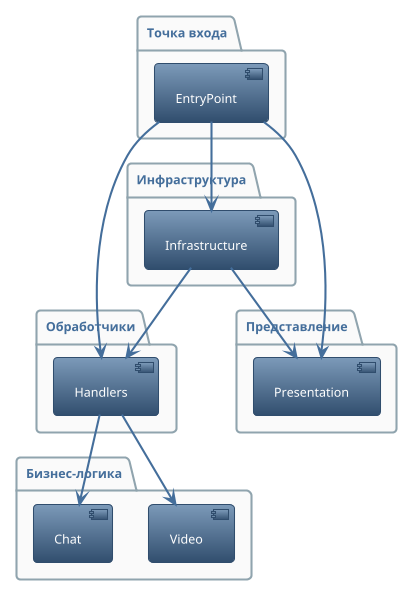

## 2.3 Архитектура видео-сервиса

Решение выделить функционал видеосвязи и чата в отдельный микросервис было принято в связи с тем, что данный функционал не требует взаимодействия с базой данных, а его основная задача — обеспечение стабильной передачи аудио- и видеопотоков, а также обмена сообщениями в реальном времени между участниками урока. Архитектура видео-сервиса построена аналогично серверной части, рассмотренной в предыдущем подразделе.

В качестве точки входа выступает модуль, отвечающий за инициализацию всех необходимых компонентов и запуск сервиса. Инфраструктурный слой включает в себя компоненты для контейнеризации, управления зависимостями, а также модуль, реализующий настройку HTTP/WebSocket сервера, маршрутизацию, логирование и обработку CORS-запросов. Внешний слой архитектуры представлен обработчиками, которые принимают и обрабатывают входящие HTTP- и WebSocket-запросы, обеспечивая взаимодействие между клиентом и бизнес-логикой.

Бизнес-логика видео-сервиса разделена на два ключевых направления: модуль видеосвязи, реализующий peer-to-peer соединения, управление комнатами и обработку медиа-потоков, и модуль чата, отвечающий за обмен текстовыми сообщениями между участниками сессии. Для отображения клиентских страниц используется слой представления, содержащий шаблоны для видеокомнаты и чата.

Взаимодействие между слоями организовано следующим образом: точка входа инициализирует инфраструктурные компоненты и сервер, сервер настраивает маршруты и обработчики, обработчики принимают запросы и взаимодействуют с бизнес-логикой, а бизнес-логика управляет состоянием комнат, участников и чата. Слой представления используется для рендеринга клиентских страниц.

---

